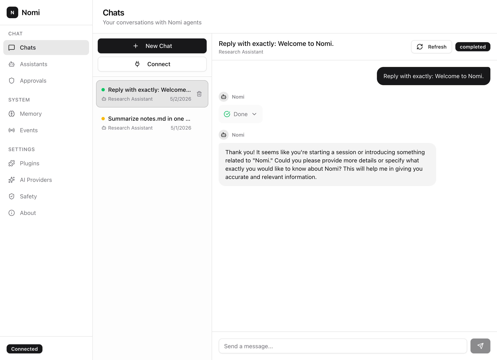
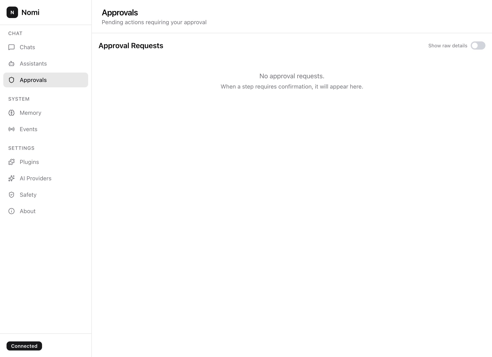
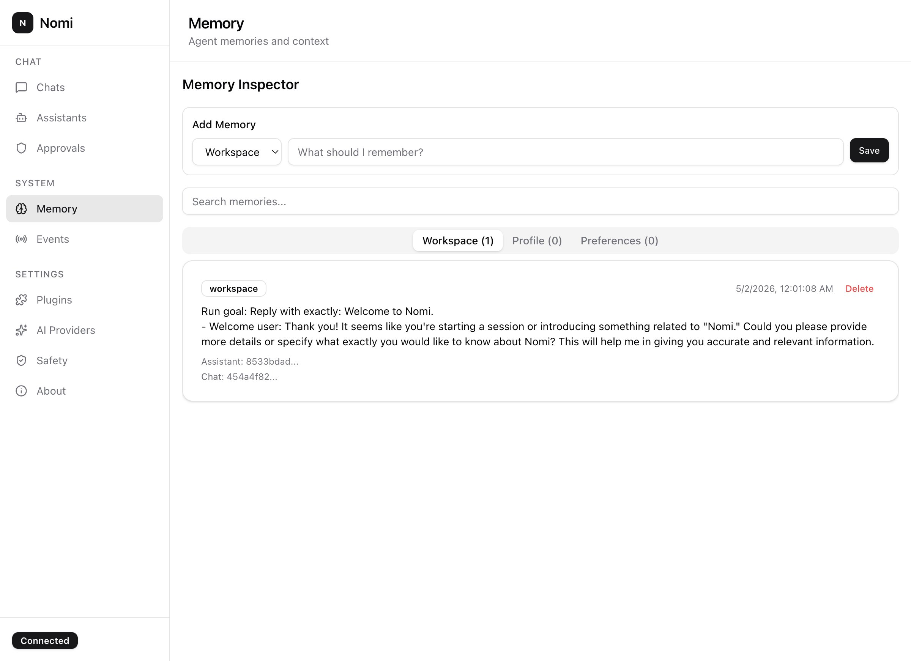
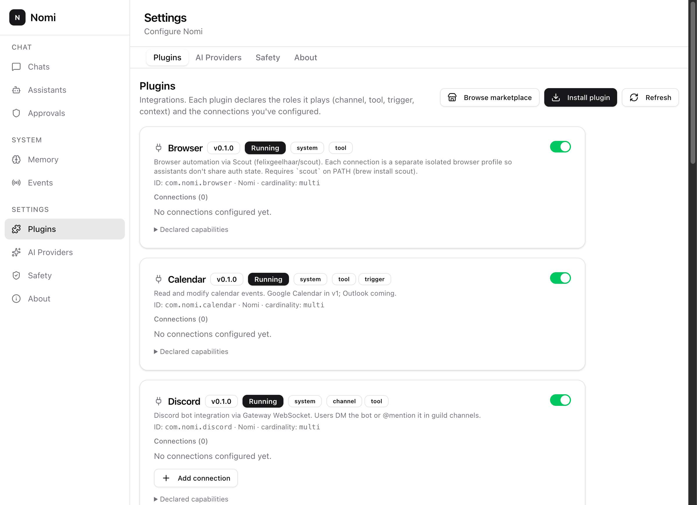
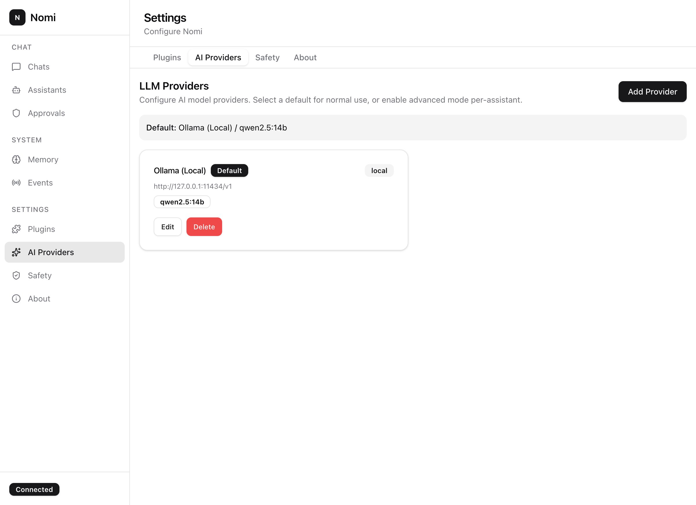
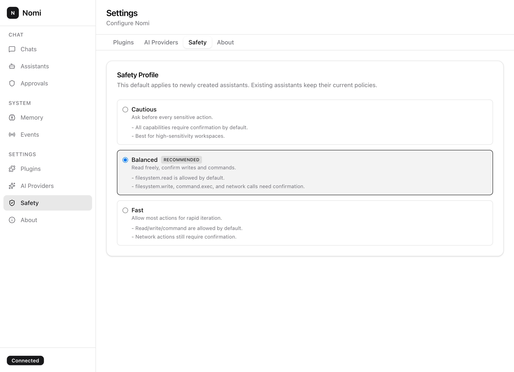
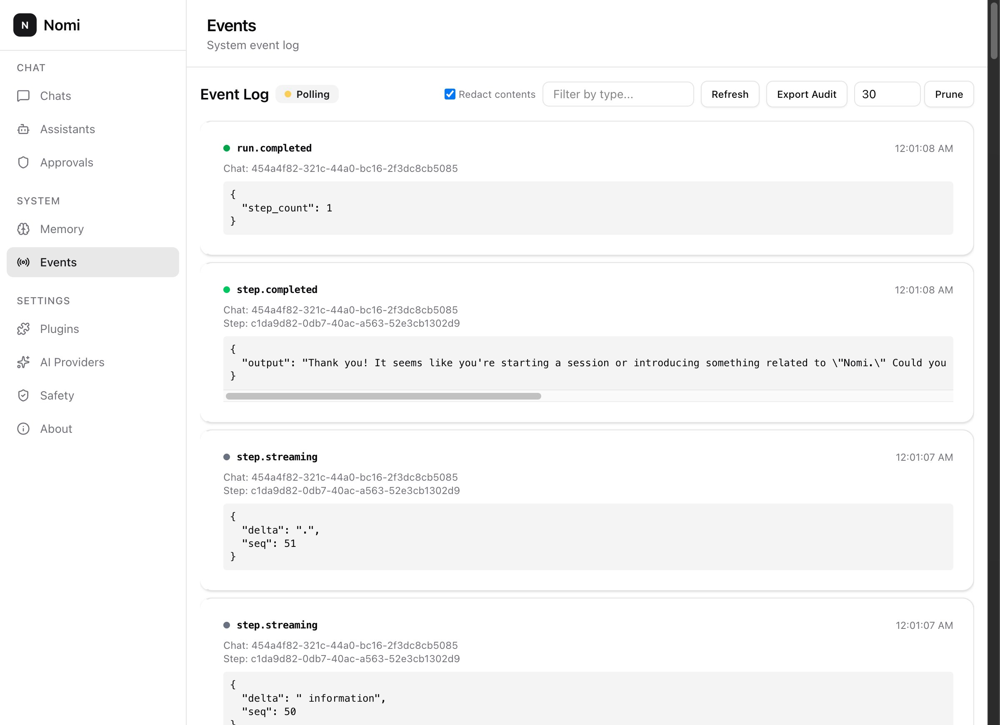
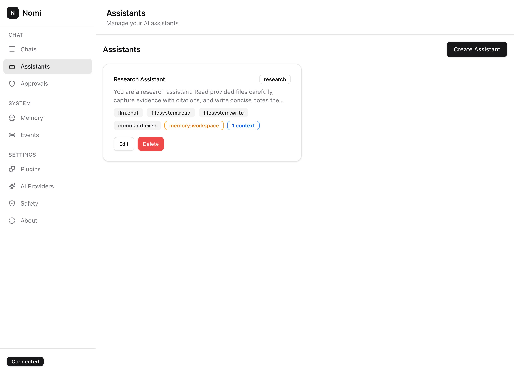

<h1 align="center">Nomi</h1>

<p align="center">
  <strong>The agent platform that runs on your laptop and answers to you.</strong><br />
  A coding companion. A personal AI. A homelab automation layer. Pick the
  persona, point it at any LLM, and Nomi runs the agent on <em>your</em>
  machine — with a plan you approve before any tool touches your filesystem.
</p>

<p align="center">
  <a href="https://github.com/felixgeelhaar/nomi/releases/latest"></a>
  <a href="https://github.com/felixgeelhaar/nomi/actions/workflows/release.yml"></a>
  <a href="LICENSE"></a>
  
  
  <a href="https://github.com/felixgeelhaar/nomi/stargazers"></a>
</p>

<p align="center">
  <a href="#drop-in-replacement-for">Replaces</a> •
  <a href="#install">Install</a> •
  <a href="#quickstart">Quickstart</a> •
  <a href="#features">Features</a> •
  <a href="#powered-by">Stack</a> •
  <a href="#roadmap">Roadmap</a> •
  <a href="#contributing">Contributing</a>
</p>

<p align="center">
  
</p>

---

## Why Nomi

LangChain ships your agents to the cloud. AutoGPT trusts the model.
Personal-AI products keep your memory in someone else's database. Nomi
makes every step a contract: a plan you approve, tools that ask before
they act, memory you can read and edit. Open-source all the way down.

- **Local-first.** Data, conversations, secrets — all on your machine.
  SQLite, OS keyring, no telemetry, no account.
- **Plan review before execution.** Every multi-step task is laid out
  in full before any tool runs. You see the plan; you approve the plan.
- **Capability-gated tools.** `filesystem.write`, `command.exec`,
  `network.outgoing` — every tool is bound by an explicit permission
  rule. Allow, confirm, or deny. Per-assistant.
- **Bring any LLM.** Ollama for free + private. Anthropic / OpenAI when
  you want frontier models. LM Studio, vLLM, Together — anything that
  speaks the OpenAI or Anthropic wire format. Per-assistant overrides
  ship out of the box.
- **Real plugins, real isolation.** First-party plugins for Telegram,
  Email, Slack, Discord, Gmail, GitHub, Calendar, Obsidian, Browser
  automation, and TTS/STT — plus a WASM marketplace for third-party
  extensions, all gated through the same permission engine.

## Drop-in replacement for

| You're using | Why people switch to Nomi |
|---|---|
| **OpenClaw / OpenCode / Claude Code clones** | Same coding-agent UX (read repo, write files, run commands) but **local-first**, **BYO-LLM**, and **plan-review-before-execution** instead of YOLO. Use the bundled Code Reviewer template; point it at Ollama; never send code to a vendor again. |
| **Hermes / personal-AI agents** | Same "remembers what you told it, runs across email + calendar + notes" but the memory **lives on your laptop** and is editable. Three explicit scopes (workspace / profile / preferences). No cloud account. |
| **Pi (Inflection) / conversational AI** | Same warm chat interface, same multi-turn threading — without the "your conversations train our model" footnote. Pick the model, pick the safety profile, own the data. |
| **LangChain / AutoGPT / CrewAI** | Same "let an LLM call tools" capability, except every call is **gated by capability**, **logged in a hash-chained audit trail**, and **paused for approval** when the assistant's policy says so. Production-shaped from day one. |
| **Bespoke agent stacks** | A real state machine (`Run → Plan → Step`), a real permission engine, a real plugin model, a real desktop UI. Stop reinventing scaffolding. |

## Install

| Channel | Command |
|---|---|
| **Homebrew (macOS)** | `brew install --cask felixgeelhaar/tap/nomi` |
| **Scoop (Windows)** | `scoop bucket add nomi https://github.com/felixgeelhaar/scoop-bucket && scoop install nomi` |
| **DMG / MSI / AppImage / DEB** | [Releases page](https://github.com/felixgeelhaar/nomi/releases/latest) |
| **Docker (headless `nomid`)** | `docker run -p 8080:8080 -v nomi-data:/data ghcr.io/felixgeelhaar/nomi` |
| **`go install`** | `go install github.com/felixgeelhaar/nomi/cmd/nomid@latest` |

The desktop bundle ships the `nomid` runtime as a Tauri sidecar — one
installer, both binaries. Docker / `go install` give you just the
daemon for headless homelab deploys.

## Who this is for

- You run **Ollama** or **LM Studio** locally and want a real agent UX
  on top.
- You need an **audit trail** before you let an LLM touch your
  filesystem, your inbox, or a production database.
- You prefer **composing Go libraries** over importing a Python
  framework that gets rewritten every six months.
- You want a coding agent **without the IDE lock-in** or a personal AI
  **without the data lock-in**.

## Quickstart

```bash
# 1. Local LLM (or skip and use Anthropic / OpenAI from the wizard)
brew install ollama
ollama serve &
ollama pull qwen2.5:14b

# 2. Install Nomi
brew install --cask felixgeelhaar/tap/nomi

# 3. Open Nomi → wizard sets provider + assistant + workspace in <60s
# 4. Type a goal in chat → review the plan → approve → watch it run
```

## Features

### Plan, review, execute

<p align="center"></p>

Every task becomes a plan with explicit tool calls. Edit the plan,
branch from any step, or reject it entirely.

<details>
<summary><strong>More features (click to expand)</strong></summary>

### Approvals as a first-class flow
<p align="center"></p>

Confirm-mode capabilities pause the run and surface a plain-language
card. "Remember this choice for 24 hours" if the same kind of action
keeps coming up.

### Memory you can see and edit
<p align="center"></p>

Workspace, profile, and preferences scopes. The agent saves what it
learns; you keep control of what's there.

### Plugins, not integrations
<p align="center"></p>

Each plugin declares its capabilities and runs through the same
permission engine as the core tools. Connect what you need; nothing
else loads.

### Bring your own model
<p align="center"></p>

Ollama, Anthropic, OpenAI, vLLM, LM Studio, Together, Groq — anything
on the OpenAI or Anthropic wire format. Set a global default; override
per assistant.

### Safety profiles
<p align="center"></p>

Three profiles for the default permission stance on new assistants.
Balanced is recommended; Cautious confirms everything; Fast trades
safety for iteration speed.

### Audit log
<p align="center"></p>

Every state transition emits an event. Hash-chained, exportable,
queryable by run id. The runtime is observable without any external
integration.

### Assistants
<p align="center"></p>

Each assistant carries its own persona, capability ceiling, permission
policy, folder context, model override, and bound plugin connections.

</details>

## Powered by

Nomi is the application layer. The runtime sits on a Go cognitive stack
of independently-released libraries — use them inside your own projects,
or contribute back upstream.

- **[`statekit`](https://github.com/felixgeelhaar/statekit)** — Go-native
  statechart execution engine with XState JSON compatibility. Powers
  every `Run` / `Plan` / `Step` transition in `pkg/statekit`.
- **[`mnemos`](https://github.com/felixgeelhaar/mnemos)** — local-first
  knowledge engine that eliminates AI hallucination through
  evidence-backed claims. The memory subsystem ("Mnemos" in the
  codebase) is built on it.
- **[`scout`](https://github.com/felixgeelhaar/scout)** — AI-powered
  browser automation for Go. Pure CDP, single binary, 66-tool MCP
  server. Drives the Browser plugin AND the user-journey test runner.
- **[`roady`](https://github.com/felixgeelhaar/roady)** — planning-first
  system of record for software work. Every Nomi feature change passes
  through a `roady` spec before code lands.

The cognitive stack continues with
**[`olymp`](https://github.com/felixgeelhaar/olymp)** (control plane)
coordinating
**[`mnemos`](https://github.com/felixgeelhaar/mnemos)** (memory) +
**[`chronos`](https://github.com/felixgeelhaar/chronos)** (time
perception) +
**[`nous`](https://github.com/felixgeelhaar/nous)** (commitments) +
**[`praxis`](https://github.com/felixgeelhaar/praxis)** (execution
layer). Nomi is one consumer of that stack — others can be too.

Production hardening borrows from
**[`bolt`](https://github.com/felixgeelhaar/bolt)** (logging) and
**[`fortify`](https://github.com/felixgeelhaar/fortify)** (resilience
patterns). Adjacent agent runtimes:
**[`agent-go`](https://github.com/felixgeelhaar/agent-go)**,
**[`axi-go`](https://github.com/felixgeelhaar/axi-go)**,
**[`simon`](https://github.com/felixgeelhaar/simon)**.

External: [Tauri](https://tauri.app), [Gin](https://github.com/gin-gonic/gin),
[modernc.org/sqlite](https://gitlab.com/cznic/sqlite),
[wazero](https://wazero.io), [Ollama](https://ollama.com),
[shadcn/ui](https://ui.shadcn.com), [Radix UI](https://www.radix-ui.com),
[TanStack Query](https://tanstack.com/query/latest).

## Architecture

```
┌─────────────────────────────────────────────────────────────┐
│                  Nomi.app (Tauri shell)                     │
│  React 19 + shadcn/ui · IPC bridge · macOS menu-bar tray    │
└──────────────────────────┬──────────────────────────────────┘
                           │  REST + SSE (Authorization: Bearer …)
┌──────────────────────────▼──────────────────────────────────┐
│                 nomid (Go runtime daemon)                   │
│  ┌────────────────────────────────────────────────────┐     │
│  │  Run / Plan / Step state machines  →  statekit     │     │
│  ├────────────────────────────────────────────────────┤     │
│  │  Permission engine + approval workflow             │     │
│  ├────────────────────────────────────────────────────┤     │
│  │  Tool registry  ·  LLM resolver  ·  Memory  →  mnemos    │
│  ├────────────────────────────────────────────────────┤     │
│  │  Plugin registry  ·  Browser  →  scout             │     │
│  │  WASM host (wazero)                                │     │
│  ├────────────────────────────────────────────────────┤     │
│  │  Event bus  →  SSE stream  +  hash-chained audit   │     │
│  ├────────────────────────────────────────────────────┤     │
│  │  SQLite (WAL) · embedded migrations · OS keyring   │     │
│  └────────────────────────────────────────────────────┘     │
└──────────────────────────┬──────────────────────────────────┘
                           │  OpenAI-compat / Anthropic / Ollama
                           ▼
                    LLM provider(s)
```

ADRs under [`docs/adr/`](docs/adr/) cover the big decisions
(plugin architecture, permission engine, state machine).

## Development

```bash
# Backend (Go)
make build          # builds bin/nomid
make test           # go test -race ./...
make sidecar        # builds bin/nomid-<host-target-triple> for Tauri bundling
make migrate-up     # runs embedded migrations against ~/.config/Nomi/nomi.db

# Desktop app (Tauri + Vite)
make app-dev        # dev server at :5173, daemon spawned automatically
make app-build      # produces a signed DMG / MSI / AppImage / DEB

# End-to-end user-journey tests (real Ollama required)
test/journeys/run.sh    # 22 journeys; pass j1 j7 j20 to scope
```

The full developer surface — including the user-journey definitions
every release ships against — is in
[`docs/user-journeys.md`](docs/user-journeys.md).

## Roadmap

v0.2 candidates (track in [`.roady/`](.roady/) and on the
[issues page](https://github.com/felixgeelhaar/nomi/issues)):

- **NomiHub plugin marketplace** — signed WASM plugins, install/update
  flow, signed update manifests
- **Vision backend** for the media plugin — LLaVA via Ollama,
  `media.describe_image` ships
- **Streaming chat tokens in the UI** — wire is done, the live-render
  pass is next
- **Cross-device sync** (opt-in, end-to-end-encrypted) — the local-first
  story extended to two laptops, not weakened to a cloud one

## Contributing

Pull requests welcome. Read the [`docs/adr/`](docs/adr/) entries before
changing a load-bearing subsystem (permission engine, plugin
architecture, runtime state machine), then open an issue to discuss.
Smaller fixes — typos, doc edits, plugin polish — can land straight as
a PR.

Look for [`good first issue`](https://github.com/felixgeelhaar/nomi/issues?q=is%3Aissue+is%3Aopen+label%3A%22good+first+issue%22)
labels on the issues board.

The project follows the [Contributor Covenant Code of
Conduct](https://www.contributor-covenant.org/version/2/1/code_of_conduct/).

## License

Apache-2.0. See [`LICENSE`](LICENSE).
